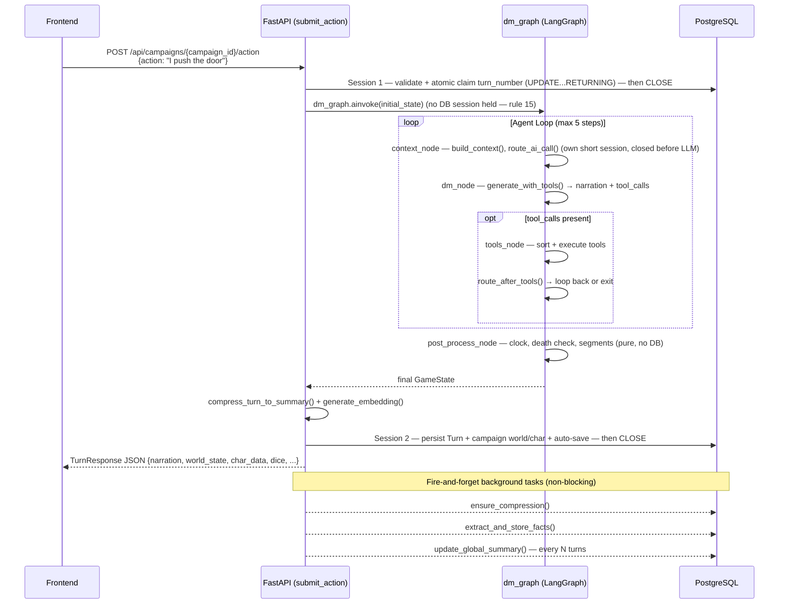
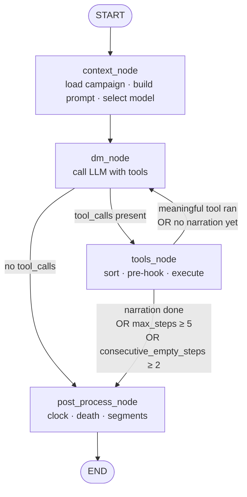
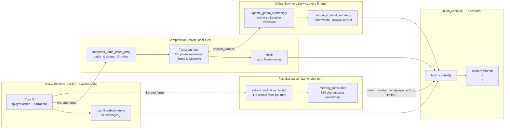
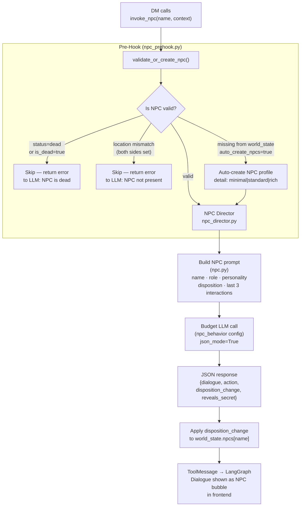
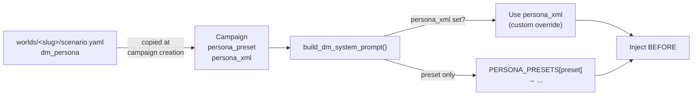
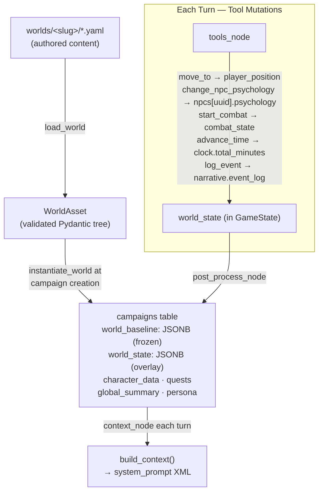
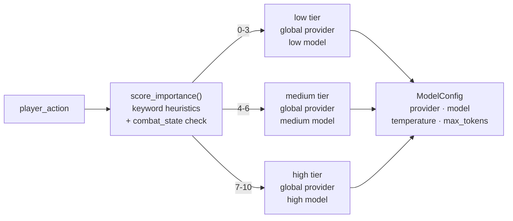

# Agentic DM Architecture

This document describes the **current production architecture** of the SAGA AI engine — the LangGraph-based DM agent loop, memory pipeline, NPC system, prompt structure, and provider layer. It documents what runs today; planned work lives in the ADRs, summarised at the end.

---

## Turn Flow

Each player turn is a single POST request that returns the complete turn result as JSON (the frontend renders narration with a typewriter effect). There are no WebSocket connections — each turn is independent. The endpoint never holds a DB session across the LLM/graph call (rule 15): a short session claims the turn number, the graph runs with no session held, and a second short session persists the result.



---

## LangGraph Graph



### Node responsibilities

| Node | Reads | Writes |
|------|-------|--------|
| `context_node` | Campaign (DB), player_action | messages, world_state, char_data, system_prompt, model_config, importance_score |
| `dm_node` | messages, system_prompt, model_config, world_state | messages (AI reply), narration, step_count |
| `tools_node` | messages (last AI msg), world_state, char_data | messages (tool results), world_state, char_data, narration_segments, time_passed_minutes, consecutive_empty_steps |
| `post_process_node` | narration, world_state, char_data, time_passed_minutes, narration_segments | world_state (clock advanced), death_event, narration_segments |

### Routing logic

**`route_after_dm`**: if last AI message has tool_calls → `tools_node`; else → `post_process_node`.

**`route_after_tools`**:
1. `step_count ≥ MAX_STEPS (5)` → exit
2. `consecutive_empty_steps ≥ cfg.consecutive_empty_steps_max (2)` → exit
3. Last AI message called a **meaningful tool** (`invoke_npc`, `request_dice`, `start_combat`, `end_combat`) → loop back to `dm_node` (DM must narrate the result)
4. Narration already accumulated → exit
5. Otherwise → loop back (DM called only silent tools, no narration yet)

---

## LLM Context: What the DM Sees Each Turn

### System Prompt (XML structure)

The system prompt is assembled by `build_dm_system_prompt()` in `app/ai/prompts/dm.py`. Every block except `<instructions>` and `<character>` is conditional.

```
[optional] <persona>
  Narrative tone block — sets voice/style without overriding rules.
  Source: campaign.persona_preset (grimdark|heroic|dark_fantasy|horror)
  or campaign.persona_xml (custom override, takes precedence).
  Always injected BEFORE <instructions>.
</persona>

<instructions>
  BASE_DM_PROMPT — core rules:
    · Narration style (plain prose, second person, no markdown)
    · Tool obligations (COMBAT, ITEMS, NPCs, QUESTS, SCENE, DICE, TIME)
    · BACKSTOP RULE: every world-state change must have a matching tool call
    · Empty/gibberish input handler (describe scene passively)
    · Multi-NPC sequential guidance (one invoke_npc at a time)
    · Multi-step tool loop rules (no re-narration on follow-up steps)
    · Dice Philosophy (DC scale, nat 20 / nat 1)
    · Narration style guidelines

  [optional] DEATH_MODE_PROMPT — ironman|destino|cronista rules
</instructions>

<character name="Eron" hp="12/20" location="Thornhaven">
  [optional] <abilities>STR 16, DEX 12, CON 14, INT 10, WIS 13, CHA 8</abilities>
  <!-- Reads flat char_data["str"|"dex"|...]. The frontend writes the full
       lowercase names, so in practice this block does NOT render today —
       a known key-convention drift owed to ADR 0010-F1. -->
  <inventory>Sword, Health Potion x2</inventory>
</character>

<scene>
  <location name="Thornhaven">
    A small village of timber-and-stone buildings.
    Connected to: Shrine of First Light, Forest Path, North Road.
  </location>

  [optional] <npcs_present>
    <npc name="Marta" role="Tavern keeper"/>
    <npc name="Aldric" role="Watch" condition="wounded" trust="wary"/>
    <!-- Only NPCs whose world_state location matches current_location.
         Attributes: the world's scene-visible trait fields, an optional
         condition, and ONLY the psychology axes currently outside their
         default band (ADR 0005 A5) — an NPC who feels nothing unusual
         carries no axis attributes at all. -->
  </npcs_present>

  [optional] <time>Day 4, evening, autumn</time>
  [optional] <weather>light rain</weather>

  [optional] <combat active="true" round="2">
    <combatants>Eron, Goblin Scout, Goblin Brute</combatants>
  </combat>
</scene>

[optional] <global_summary>
  Rolling story arc paragraph (~200 words). Updated every 5 turns.
  Captures campaign-spanning narrative: who Eron is, what happened,
  current situation. Never reset — always extended.
</global_summary>

[optional] <history label="story_so_far">
  Batch summaries of turns outside the Active Window.
  Each summary is 2-3 sentences covering a 5-turn block.
  Up to 5 summaries (= last 25-40 turns before the Active Window).
  Format: "[Turns N-M] The player verb. First_sentence."
</history>

[optional] <recalled_memories>
  - Marta mentioned her son disappeared near the old mine three weeks ago.
  - The artifact glows when touched by someone with Hollow blood.
  - Guard Captain Aldric is secretly allied with The Hollow faction.
  <!-- Top-3 pgvector hits: MemoryFacts semantically similar to player_action -->
</recalled_memories>

[optional] <quests>
  <quest name="Who Am I?" status="active"/>
  <quest name="The Missing Miners" status="active"/>
</quests>
```

### Psychology axes, not a disposition scalar

There is no fixed ±100 "disposition" any more. Each world declares its own axes in
`taxonomy.yaml` — name, range, default, and the bands that name each stretch of the range
— and the prompt renders the **band label**, never the number: the DM reads `trust="wary"`,
not `trust=-24`. An axis is only shown when it is salient, i.e. sitting in a band other
than its default, so a scene block stays short and what appears in it is what changed.
See ADR [`0005`](adr/0005-npc-multi-axis-psychology.md).

### Message History (conversation turns)

```
messages = [
  {role: "user",      content: "I ask Marta about the mine"},   # turn N-7
  {role: "assistant", content: "Marta wipes the counter..."},    # turn N-7 narration
  ...                                                             # turns N-6 to N-1 (Active Window)
  {role: "user",      content: "I push open the tavern door"},   # current action
]
```

- **Active Window**: last `gameplay.context_window_turns` (default 8) turns verbatim
- **Token budget**: if total tokens > `gameplay.context_token_cap` (default 12000), oldest user+assistant pairs are dropped until it fits. The current action (last user message) is always preserved.
- **Older turns**: available as batch summaries in `<history>` (not verbatim)

---

## Memory Pipeline



### Three-tier recall

| Tier | What | How | Depth |
|------|------|-----|-------|
| **Active Window** | Full verbatim turns | `messages[]` | Last 8 turns |
| **Rolling Summary** | Batch summaries + global arc | `<history>` + `<global_summary>` | Last ~40+ turns |
| **Semantic Search** | Specific facts (names, events, secrets) | pgvector cosine similarity on MemoryFact | All turns ever |

### Compressor behavior
- Batch: groups of turns with the same `batch_id` are idempotent (re-run produces the same `Turn.summary`)
- Retry: up to `summarization.max_retries` (3) attempts with exponential backoff `[1s, 5s, 30s]`
- On final failure: `Turn.summarization_failed = True`, no summary stored (batch summary omitted for that range)
- Format heuristic: `"[Turns N-M] The player {verb}. {first_sentence}."` — no verbatim NPC dialogue, paraphrase only

---

## NPC Pipeline



### Auto-create detail levels (`npc_auto_create_detail`)

| Level | Fields created |
|-------|---------------|
| `minimal` | name, location, disposition=0 |
| `standard` | + role, personality, motivation, last_interactions=[] |
| `rich` | + secret, fear |

---

## Persona System

Persona blocks set the DM's narrative tone without overriding tool rules or game mechanics.



### Built-in presets (`app/ai/prompts/presets.py`)

| Preset | Tone |
|--------|------|
| `grimdark` | Brutal, cold, every victory has a price |
| `heroic` | Epic, cinematic, the world responds to courage |
| `dark_fantasy` | Decaying grandeur, moral ambiguity, corrupted magic |
| `horror` | Restraint + sensory details, slow dread, visceral when it hits |

A world's `scenario.dm_persona` lands on the campaign as `persona_xml` and overrides the preset. If neither is set, no `<persona>` block appears.

---

## Tool Loop Mechanics

### Tool groups (dynamic loading)

Tools are loaded per-turn based on world state. The DM never sees more than ~12 tools simultaneously.

Groups and their activation predicates are declared in `saga.config.yaml`; the predicates
themselves are typed Python functions in `tools/tool_groups.py` (no `eval`).

| Group | Activation | Tools |
|-------|-----------|-------|
| `core` | Always | `move_to`, `advance_time`, `set_scene_mood`, `log_event`, `update_quest`, `update_npc` |
| `combat_entry` | Always | `start_combat` |
| `combat` | `combat_state.active` | `request_dice`, `apply_damage`, `end_combat`, `update_hp` |
| `social` | `npcs` non-empty | `invoke_npc`, `change_npc_psychology`, `kill_npc`, `remove_npc`, `restore_npc` |
| `inventory` | Always | `add_item`, `remove_item` |

### Tool call ordering (`tools_node`)

Within a single step, tool calls are sorted before execution:

```
1. request_dice   (sort key: 0) — dice must resolve before NPC reactions
2. all other tools (sort key: 1)
3. invoke_npc     (sort key: 2) — NPC speaks last, after world events
```

### Meaningful tools and loop continuation

`_MEANINGFUL_TOOLS = {invoke_npc, request_dice, start_combat, end_combat}`

When any meaningful tool runs, the loop returns to `dm_node` so the DM can narrate the result (NPC dialogue, dice outcome, combat opening). Silent tools (move_to, set_scene_mood, etc.) alone do not trigger a loop-back.

### `consecutive_empty_steps` guard

Prevents infinite silent-tool loops where the DM calls only fire-and-forget tools and produces no narration:

```
step 1: DM calls [advance_time, set_scene_mood] — no narration text
        → consecutive_empty_steps = 1
step 2: DM calls [log_event] — no narration text
        → consecutive_empty_steps = 2 → EXIT (≥ consecutive_empty_steps_max)
```

### All tools

#### Visible (frontend events)

| Tool | Args | Effect | Frontend |
|------|------|--------|----------|
| `request_dice` | check, dc, stat, reason | Server-side d20 roll | Dice UI, click-to-reveal |
| `invoke_npc` | name, context | NPC Director LLM call | NPC dialogue bubble |
| `start_combat` | enemies[] | Init combat state + initiative | CombatTracker overlay |
| `end_combat` | — | Reset combat state | CombatTracker hides |
| `apply_damage` | target, amount, damage_type | HP change to combatant | CombatTracker update |
| `update_hp` | change, reason | Player HP +/- | HP bar flash |
| `add_item` | name, description, quantity | Add to inventory | Toast notification |
| `remove_item` | name | Remove from inventory | Toast notification |

#### Silent (no frontend event)

| Tool | Args | Effect |
|------|------|--------|
| `move_to` | location | Resolves the destination against the spatial graph, then writes `world_state.player_position` (and mirrors it into `meta.current_location`) |
| `update_quest` | name, status, description | Quest lifecycle (active/completed/failed/abandoned) |
| `change_npc_psychology` | npc, axis deltas, reason | Moves the NPC's world-defined psychology axes (ADR 0005) |
| `update_npc` | npc, fields | Creates or updates NPC identity/trait fields (ADR 0009) |
| `kill_npc` / `remove_npc` / `restore_npc` | npc, reason | NPC lifecycle and condition transitions (ADR 0009) |
| `log_event` | description | Append to `world_state.narrative.event_log` |
| `set_scene_mood` | mood | CSS mood transition on frontend |
| `advance_time` | minutes | Game clock forward (affects day/season display) |

---

## Provider Support

| Provider | Tool Calling | JSON Mode | Notes |
|----------|-------------|-----------|-------|
| Google Gemini | Native | `response_mime_type: application/json` | Shipped default — a pro tier for the DM's narrative peaks, flash for everything else |
| OpenAI | Native | `response_format: {type: json_object}` | Most reliable tool calling |
| Anthropic | Native | Prompt-based (no API param) | Best narrative quality |
| Local/OpenRouter | Via OpenAI SDK | `response_format: {type: json_object}` | Depends on model |

All NPC, companion, and world simulation calls use `json_mode=True`. DM narration calls use `generate_with_tools()` (structured tool calling, not JSON mode).

---

## Data Flow: World → World State → Context

A world is authored as a tree of YAML under `worlds/<slug>/` — `world.yaml` and
`scenario.yaml` at the root, then `nodes/` (nested by containment), `edges/`, `factions/`,
`npcs/` and `encounters/`. Creating a campaign **instantiates** it into two JSONB columns
that play different roles for the whole campaign:

- **`world_baseline`** — the authored content frozen at creation: the spatial graph, node
  descriptions, faction definitions, encounter tables. Read-only during play, so a world
  edited afterwards never mutates a campaign already in progress.
- **`world_state`** — the mutable overlay: where the player is, who is where, what changed.
  This is what tools write and what `build_context()` reads.



Node ids are UUIDs minted at instantiation; the authored slugs survive as resolution
aliases, so a tool call naming a place by its human name still resolves. The world model
itself — layering, containment, the spatial graph — is ADR
[`0008`](adr/0008-world-model-multilayer-yaml.md).

### `world_state` schema

`meta.schema_version` is bumped whenever the overlay shape changes.

```json
{
  "meta": {
    "schema_version": 7,
    "world_name": "The Awakening",
    "setting": "A verdant forest surrounds the ancient Shrine of First Light...",
    "current_location": "<node-uuid>",
    "current_season": "spring",
    "opening_narration": "Your eyes open to a canopy of ancient oaks..."
  },
  "player_position": "<node-uuid>",
  "clock": { "total_minutes": 480 },
  "time_of_day": "morning",
  "weather": "clear",
  "npcs": {
    "<npc-uuid>": {
      "slug": "lyra",
      "name": "Lyra",
      "location": "<node-uuid>",
      "faction": "thornhaven-council",
      "psychology": { "trust": -20, "fear": 0, "respect": 0 },
      "traits": { "role": "Ranger", "motivation": "protect her family" },
      "met_player": false
    }
  },
  "companions": {},
  "factions": { "The Hollow": { "description": "...", "disposition": 0 } },
  "combat_state": {
    "active": false,
    "round": 0,
    "initiative_order": [],
    "current_turn_index": 0
  },
  "narrative": { "event_log": [] },
  "node_status": {},
  "edge_overrides": [],
  "consumed_encounters": {},
  "destino_lives": 3
}
```

Two things worth reading off that shape. NPCs are keyed by **UUID**, not by display name —
renaming an NPC mid-campaign no longer orphans its record (ADR
[`0009`](adr/0009-npc-enrichment.md)). And affect is not one scalar: `psychology` holds the
axes the *world* defines, so a horror world and a political one can disagree about what an
NPC even feels (ADR [`0005`](adr/0005-npc-multi-axis-psychology.md)).

---

## Importance Scoring & Model Routing



High-importance keywords (+2): `attack`, `fight`, `confront`, `betray`, `confess`, `reveal`, `final`
Low-importance keywords (-2): `look around`, `rest`, `wait`, `inventory`, `check`
Active combat: +2

Configured in `saga.config.yaml` under `dm_narration.low|medium|high`.

> **Known limitation.** The routing machinery is real; the score feeding it is not yet.
> The keyword lists are English-only, so a campaign played in any other language never
> matches one and the score stays at its base of 5 — always the medium tier. The combat
> bump reads `world_state["in_combat"]`, a key with no writer anywhere (the live flag is
> `combat_state.active`), so it never fires either. Replacing this is ADR
> [`0016`](adr/0016-importance-scoring.md), which reuses the embedding each turn already
> computes rather than paying for a classifier call.

---

## Security

- **Injection detection**: `sanitize_player_input()` strips dangerous characters; `detect_injection()` replaces prompt-injection attempts with `[The player looks around cautiously]`
- **Content policy**: `ContentPolicyError` caught per-provider; returns `CONTENT_POLICY_NARRATION` fallback
- **API keys**: AES-256 encrypted at rest in `user_api_keys` table
- **Auth**: JWT bearer tokens, bcrypt password hashing

---

## Semantic Resolver — Current Status

**Status**: Disabled (`gameplay.semantic_resolver_enabled: false`). Code preserved.

It was meant to sit in front of the DM call and decide what the turn is *about* — filtering
NPCs, classifying intent to pick tool groups, scoring importance, selecting the relevant
quest thread. It is off because each of those jobs is now owned by a decision that does it
better or cheaper: importance scoring by ADR
[`0016`](adr/0016-importance-scoring.md) (reusing the turn's existing embedding instead of
adding a call), and recall/NPC relevance by ADR
[`0002`](adr/0002-relationship-graph-recall.md). The code stays until those land.

---

## Architectural Decisions

### Project Constraints
- **Open source on GitHub**, BYOAK (bring your own API key)
- **Self-hosted**: each user runs their own instance locally — no scaling concerns
- **v2 multiplayer**: local instance shared between players (turn flow TBD)
- **Configurable features**: expensive AI patterns must be opt-in via `saga.config.yaml`

### Key Decisions

| Decision | Choice | Rationale |
|----------|--------|-----------|
| Transport | REST + JSON (not WebSocket/SSE) | Each turn is an independent POST returning the full result; no connection state to manage. The frontend renders narration with a typewriter effect, so token-level streaming isn't required. |
| Agent framework | LangGraph 1.0 | Explicit graph routing, typed state, conditional edges |
| Provider routing | Gemini 2.5 Pro for DM (default) | Best tool-calling reliability at cost point |
| pgvector | Basic (vector only) now, hybrid RRF behind `gameplay.pgvector_hybrid` flag | Hybrid adds complexity; basic cosine is sufficient for v1 |
| Global summary storage | `Campaign.global_summary` column | Zero-join hot path in `context_node` |
| NPC auto-create | Config flag + 3 detail levels | Balances world coherence vs token cost |
| Persona system | `persona_preset` enum + `persona_xml` override | Curated quality (4 presets) with escape hatch for custom campaigns |
| Tool max in context | ~12 tools max | Empirical limit for reliable tool calling on medium models |
| Disposition scale | ±100 | Granular enough for meaningful increments (+5 for small favor, +30 for major quest) |

### Anti-Patterns to Avoid

- Loading all 30+ tools into every prompt (degrades model accuracy)
- Single LLM doing both narration AND world simulation
- Mutating world_state without event log (loses debuggability)
- Hardcoding feature toggles in code (breaks BYOAK promise)
- Stuffing the whole authored world into the system prompt (token waste)
- Exposing Python stack traces in tool error messages (confuses LLM)
- Reflection / agent loops without a hard `max_iterations` termination guard
- Holding a DB session open across an LLM call (blocks connection pool for seconds to minutes)

---

## LangGraph Patterns

### Correct patterns (LangGraph 1.0)

- **TypedDict + Annotated reducers**: Graph state must be a `TypedDict` with `Annotated[T, reducer]` fields. Custom reducers (e.g. `operator.add` for list accumulation) prevent state merge conflicts when multiple nodes write the same key.
- **Durable checkpointing**: Use LangGraph's built-in checkpointer (Postgres or SQLite backend) so that interrupted turns can resume from the last completed node rather than restarting from scratch.
- **Send API for fan-out**: When multiple NPC calls or world-sim tasks must run in parallel, use `Send` to dispatch sub-graph invocations as independent edges. Do not iterate with `invoke_npc` calls in a Python loop inside a single node.
- **Hard `max_iterations` cap**: The coordinator `route_after_tools` MUST exit at `MAX_STEPS` (currently 5). This is non-negotiable — uncapped loops cause runaway costs and LLM timeouts.

### Anti-patterns

- Reflection loops without termination: a loop that re-runs `dm_node` until "quality is good enough" with no hard cap will eventually hang.
- Passing mutable dicts directly through state: use `dict.copy()` or model `model_copy()` before mutating to avoid cross-step bleed.

---

## DB Session Pattern

DB sessions must never be held open across LLM calls. An LLM call can take 5–30 seconds; holding a session open for that duration exhausts the connection pool under concurrent load.

**Correct pattern:**
```
open session → read campaign + world_state → close session
→ call LLM (potentially slow)
→ open session → write Turn + updated world_state → close session
```

**Status: enforced (2026-06).** The endpoint and every node now follow this pattern — short
sessions around the graph, no session held across the LLM call. The former WebSocket handler that
violated it has been removed. See ADR [`adr/0001-db-session-lifecycle.md`](adr/0001-db-session-lifecycle.md).

---

## Refactor Candidates — Resolved (2026-06)

The structural debt previously tracked here was cleared in the June 2026 refactor:
- `dm_tools.py` was split into `tools_base` + per-group `tools_combat/inventory/world/special` modules behind a facade.
- The pre-LangGraph `core/agent.py` and `core/streaming.py` were deleted as dead code (the live turn path is `api/turns.py → dm_graph`).
- The DB session lifecycle was fixed — short sessions only, none spanning the LLM call (see ADR 0001).
- `MEANINGFUL_TOOLS` now lives once in `app/ai/tools/dm_tools.py` and is imported by the graph (single source of truth).

See [`../CHANGELOG.md`](../CHANGELOG.md) and [`archive/audit/AUDIT_APRIL_2026.md`](archive/audit/AUDIT_APRIL_2026.md) for the full record.

---

## Security Hardening — Resolved (2026-06)

The confirmed vulnerabilities from the 2026-04-22 audit have been addressed:

1. **Config secrets startup validation** — `app/config.py` has a Pydantic `@model_validator(mode="after")` that refuses to start in `prod` if `jwt_secret` or `api_key_encryption_key` still hold the `change-me` sentinel.
2. **JWT not in query parameters** — the WebSocket upgrade endpoint that passed the token as a query param has been removed; turns are REST and auth uses the `Authorization: Bearer` header.
3. **DB session lifecycle** — sessions no longer span the LLM call (A-3); `context_node` opens and closes its own short session before the LLM phase, and the endpoint writes in a final short session. See ADR [`adr/0001-db-session-lifecycle.md`](adr/0001-db-session-lifecycle.md).

---

## Where the architecture goes next

This document describes what runs. Where the architecture is *going* is not decided here —
each direction is an ADR, with its open forks and the alternatives that were rejected. The
ones that change the shape of the turn loop above:

| ADR | What it changes about this document |
|---|---|
| [`0006`](adr/0006-ai-director-layer.md) — AI Director layer | Adds a proactive layer **above** the DM: a background agent that moves absent NPCs, advances faction agendas, plants and pays off foreshadowing, and schedules future events. Today the world only moves as a side-effect of the DM's tool calls during a player turn. |
| [`0017`](adr/0017-npc-dialogue-turn-architecture.md) — NPC dialogue turn architecture | Questions the mid-turn `invoke_npc` call itself. It serialises the DM and NPC models (a three-beat scene costs ~7 sequential round-trips) and the tool boundary breaks the rhythm of a scene; the alternative is a parallel pre-pass. **WIP, nothing decided.** |
| [`0002`](adr/0002-relationship-graph-recall.md) — Relationship graph | Adds a second recall layer beside pgvector, plus recency weighting and location/participant awareness in the query. Today `search_similar_facts` is pure top-K cosine against the naked player action. |
| [`0016`](adr/0016-importance-scoring.md) — Importance scoring | Replaces the English-keyword scorer that makes routing a no-op in any other language, reusing the embedding each turn already computes. |
| [`0003`](adr/0003-deterministic-combat-resolution.md) — Deterministic resolution | Moves damage, statblocks and initiative fully engine-side, and unifies checks in and out of combat. Removes `start_combat` from the tool surface. |
| [`0009`](adr/0009-npc-enrichment.md) · [`0014`](adr/0014-npc-promotion.md) — NPC identity, lifecycle, promotion | Already partly landed (UUID keys, `update_npc`, lifecycle tools). 0014 adds promotion: any NPC can gain a sheet and a dedicated acting brain — companions and elites are the same object with opposite sign. |
| [`0010`](adr/0010-player-character-customization.md) · [`0012`](adr/0012-active-abilities.md) · [`0015`](adr/0015-commerce.md) — Sheet, abilities, commerce | Add typed character data, a structured input rail beside free text, and engine-computed prices. All three follow 0003's posture: the model never picks a number. |
| [`0004`](adr/0004-dm-core-game-system-separation.md) — DM core vs game system | Splits `dm.yaml` (one blob of universal GM craft plus hand-written tool obligations) into a stable core and per-world content rules. |

The full set, including the accepted ones this document already reflects, is in
[`adr/`](adr/).
