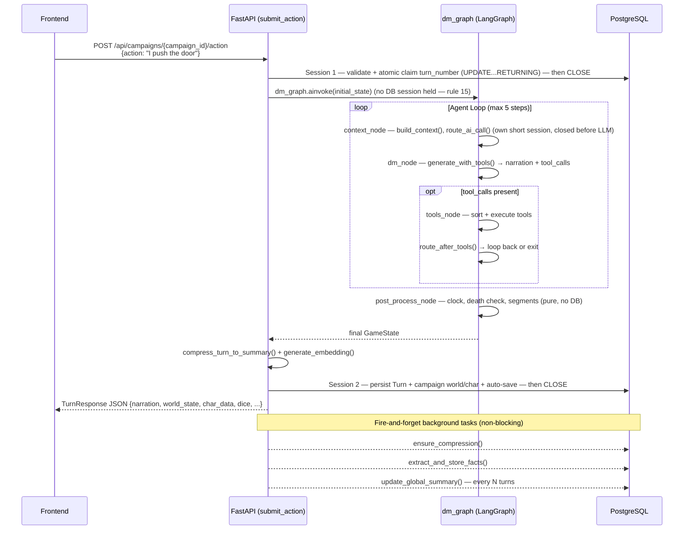
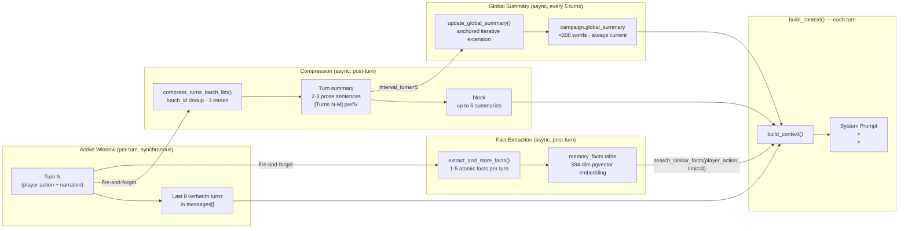
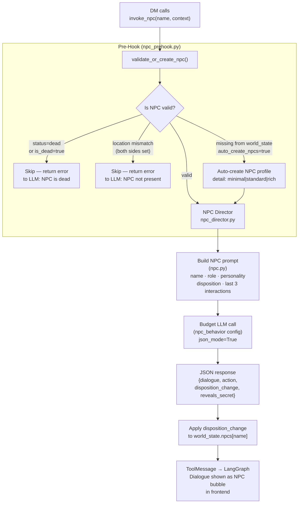
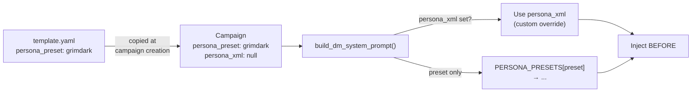
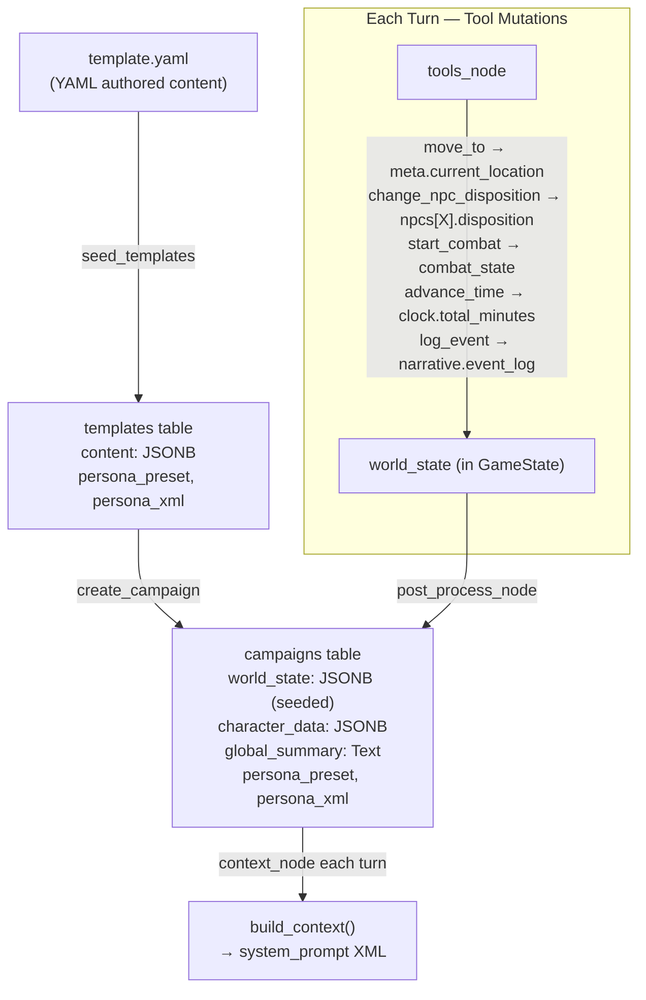
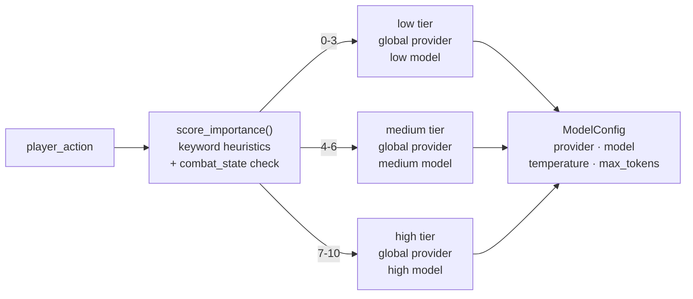

# Agentic DM Architecture

This document describes the current production architecture of the SAGA AI engine — the LangGraph-based DM agent loop, memory pipeline, NPC system, prompt structure, and provider layer. Sections marked **[Future]** describe planned work not yet implemented.

---

## Turn Flow

Each player turn is a single POST request that returns the complete turn result as JSON (the frontend renders narration with a typewriter effect). There are no WebSocket connections — each turn is independent. The endpoint never holds a DB session across the LLM/graph call (rule 15): a short session claims the turn number, the graph runs with no session held, and a second short session persists the result.



---

## LangGraph Graph


### Node responsibilities

| Node | Reads | Writes |
|------|-------|--------|
| `context_node` | Campaign (DB), player_action | messages, world_state, char_data, system_prompt, model_config, importance_score |
| `dm_node` | messages, system_prompt, model_config, world_state | messages (AI reply), narration, step_count |
| `tools_node` | messages (last AI msg), world_state, char_data | messages (tool results), world_state, char_data, narration_segments, time_passed_minutes, consecutive_empty_steps |
| `post_process_node` | narration, world_state, char_data, time_passed_minutes, narration_segments | world_state (clock advanced), death_event, narration_segments |

### Routing logic

**`route_after_dm`**: if last AI message has tool_calls → `tools_node`; else → `post_process_node`.

**`route_after_tools`**:
1. `step_count ≥ MAX_STEPS (5)` → exit
2. `consecutive_empty_steps ≥ cfg.consecutive_empty_steps_max (2)` → exit
3. Last AI message called a **meaningful tool** (`invoke_npc`, `request_dice`, `start_combat`, `end_combat`) → loop back to `dm_node` (DM must narrate the result)
4. Narration already accumulated → exit
5. Otherwise → loop back (DM called only silent tools, no narration yet)

---

## LLM Context: What the DM Sees Each Turn

### System Prompt (XML structure)

The system prompt is assembled by `build_dm_system_prompt()` in `app/ai/prompts/dm.py`. Every block except `<instructions>` and `<character>` is conditional.

```
[optional] <persona>
  Narrative tone block — sets voice/style without overriding rules.
  Source: template.persona_preset (grimdark|heroic|dark_fantasy|horror)
  or template.persona_xml (custom override, takes precedence).
  Always injected BEFORE <instructions>.
</persona>

<instructions>
  BASE_DM_PROMPT — core rules:
    · Narration style (plain prose, second person, no markdown)
    · Tool obligations (COMBAT, ITEMS, NPCs, QUESTS, SCENE, DICE, TIME)
    · BACKSTOP RULE: every world-state change must have a matching tool call
    · Empty/gibberish input handler (describe scene passively)
    · Multi-NPC sequential guidance (one invoke_npc at a time)
    · Multi-step tool loop rules (no re-narration on follow-up steps)
    · Dice Philosophy (DC scale, nat 20 / nat 1)
    · Narration style guidelines

  [optional] DEATH_MODE_PROMPT — ironman|destino|cronista rules
</instructions>

<character name="Eron" hp="12/20" location="Thornhaven">
  <abilities>STR 16, DEX 12, CON 14, INT 10, WIS 13, CHA 8</abilities>
  <inventory>Sword, Health Potion x2</inventory>
</character>

<scene>
  <location name="Thornhaven">
    A small village of timber-and-stone buildings.
    Connected to: Shrine of First Light, Forest Path, North Road.
  </location>

  [optional] <npcs_present>
    <npc name="Marta" disposition="neutral" role="Tavern keeper"/>
    <npc name="Guard" disposition="unfriendly" role="Watch"/>
    <!-- Only NPCs whose world_state location matches current_location -->
  </npcs_present>

  [optional] <time>Day 4, evening, autumn</time>
  [optional] <weather>light rain</weather>

  [optional] <combat active="true" round="2">
    <combatants>Eron, Goblin Scout, Goblin Brute</combatants>
  </combat>
</scene>

[optional] <global_summary>
  Rolling story arc paragraph (~200 words). Updated every 5 turns.
  Captures campaign-spanning narrative: who Eron is, what happened,
  current situation. Never reset — always extended.
</global_summary>

[optional] <history label="story_so_far">
  Batch summaries of turns outside the Active Window.
  Each summary is 2-3 sentences covering a 5-turn block.
  Up to 5 summaries (= last 25-40 turns before the Active Window).
  Format: "[Turns N-M] The player verb. First_sentence."
</history>

[optional] <recalled_memories>
  - Marta mentioned her son disappeared near the old mine three weeks ago.
  - The artifact glows when touched by someone with Hollow blood.
  - Guard Captain Aldric is secretly allied with The Hollow faction.
  <!-- Top-3 pgvector hits: MemoryFacts semantically similar to player_action -->
</recalled_memories>

[optional] <quests>
  <quest name="Who Am I?" status="active"/>
  <quest name="The Missing Miners" status="active"/>
</quests>
```

### Disposition labels (±100 scale)

| Range | Label |
|-------|-------|
| > 30 | loyal |
| > 10 | friendly |
| ≥ -10 | neutral |
| ≥ -30 | unfriendly |
| < -30 | hostile |

### Message History (conversation turns)

```
messages = [
  {role: "user",      content: "I ask Marta about the mine"},   # turn N-7
  {role: "assistant", content: "Marta wipes the counter..."},    # turn N-7 narration
  ...                                                             # turns N-6 to N-1 (Active Window)
  {role: "user",      content: "I push open the tavern door"},   # current action
]
```

- **Active Window**: last `gameplay.context_window_turns` (default 8) turns verbatim
- **Token budget**: if total tokens > `gameplay.context_token_cap` (default 12000), oldest user+assistant pairs are dropped until it fits. The current action (last user message) is always preserved.
- **Older turns**: available as batch summaries in `<history>` (not verbatim)

---

## Memory Pipeline



### Three-tier recall

| Tier | What | How | Depth |
|------|------|-----|-------|
| **Active Window** | Full verbatim turns | `messages[]` | Last 8 turns |
| **Rolling Summary** | Batch summaries + global arc | `<history>` + `<global_summary>` | Last ~40+ turns |
| **Semantic Search** | Specific facts (names, events, secrets) | pgvector cosine similarity on MemoryFact | All turns ever |

### Compressor behavior
- Batch: groups of turns with the same `batch_id` are idempotent (re-run produces the same `Turn.summary`)
- Retry: up to `summarization.max_retries` (3) attempts with exponential backoff `[1s, 5s, 30s]`
- On final failure: `Turn.summarization_failed = True`, no summary stored (batch summary omitted for that range)
- Format heuristic: `"[Turns N-M] The player {verb}. {first_sentence}."` — no verbatim NPC dialogue, paraphrase only

---

## NPC Pipeline



### Auto-create detail levels (`npc_auto_create_detail`)

| Level | Fields created |
|-------|---------------|
| `minimal` | name, location, disposition=0 |
| `standard` | + role, personality, motivation, last_interactions=[] |
| `rich` | + secret, fear |

---

## Persona System

Persona blocks set the DM's narrative tone without overriding tool rules or game mechanics.



### Built-in presets (`app/ai/prompts/presets.py`)

| Preset | Tone |
|--------|------|
| `grimdark` | Brutal, cold, every victory has a price |
| `heroic` | Epic, cinematic, the world responds to courage |
| `dark_fantasy` | Decaying grandeur, moral ambiguity, corrupted magic |
| `horror` | Restraint + sensory details, slow dread, visceral when it hits |

Custom `persona_xml` on the template overrides the preset. If neither is set, no `<persona>` block appears.

---

## Tool Loop Mechanics

### Tool groups (dynamic loading)

Tools are loaded per-turn based on world state. The DM never sees more than ~12 tools simultaneously.

| Group | Activation | Tools |
|-------|-----------|-------|
| `core` | Always | `move_to`, `advance_time`, `set_scene_mood`, `log_event`, `update_quest` |
| `combat_entry` | Always | `start_combat` |
| `combat` | `combat_state.active` | `request_dice`, `apply_damage`, `end_combat`, `update_hp` |
| `social` | NPCs present at location | `invoke_npc`, `change_npc_disposition` |
| `inventory` | Always | `add_item`, `remove_item` |

### Tool call ordering (`tools_node`)

Within a single step, tool calls are sorted before execution:

```
1. request_dice   (sort key: 0) — dice must resolve before NPC reactions
2. all other tools (sort key: 1)
3. invoke_npc     (sort key: 2) — NPC speaks last, after world events
```

### Meaningful tools and loop continuation

`_MEANINGFUL_TOOLS = {invoke_npc, request_dice, start_combat, end_combat}`

When any meaningful tool runs, the loop returns to `dm_node` so the DM can narrate the result (NPC dialogue, dice outcome, combat opening). Silent tools (move_to, set_scene_mood, etc.) alone do not trigger a loop-back.

### `consecutive_empty_steps` guard

Prevents infinite silent-tool loops where the DM calls only fire-and-forget tools and produces no narration:

```
step 1: DM calls [advance_time, set_scene_mood] — no narration text
        → consecutive_empty_steps = 1
step 2: DM calls [log_event] — no narration text
        → consecutive_empty_steps = 2 → EXIT (≥ consecutive_empty_steps_max)
```

### All tools

#### Visible (frontend events)

| Tool | Args | Effect | Frontend |
|------|------|--------|----------|
| `request_dice` | check, dc, stat, reason | Server-side d20 roll | Dice UI, click-to-reveal |
| `invoke_npc` | name, context | NPC Director LLM call | NPC dialogue bubble |
| `start_combat` | enemies[] | Init combat state + initiative | CombatTracker overlay |
| `end_combat` | — | Reset combat state | CombatTracker hides |
| `apply_damage` | target, amount, damage_type | HP change to combatant | CombatTracker update |
| `update_hp` | change, reason | Player HP +/- | HP bar flash |
| `add_item` | name, description, quantity | Add to inventory | Toast notification |
| `remove_item` | name | Remove from inventory | Toast notification |

#### Silent (no frontend event)

| Tool | Args | Effect |
|------|------|--------|
| `move_to` | location | Updates `world_state.meta.current_location` |
| `update_quest` | name, status, description | Quest lifecycle (active/completed/failed/abandoned) |
| `change_npc_disposition` | npc, delta, reason | NPC disposition ±100 |
| `log_event` | description | Append to `world_state.narrative.event_log` |
| `set_scene_mood` | mood | CSS mood transition on frontend |
| `advance_time` | minutes | Game clock forward (affects day/season display) |

---

## Provider Support

| Provider | Tool Calling | JSON Mode | Notes |
|----------|-------------|-----------|-------|
| Google Gemini | Native | `response_mime_type: application/json` | gemini-2.5-pro for DM, gemini-2.5-flash for NPC/compression |
| OpenAI | Native | `response_format: {type: json_object}` | Most reliable tool calling |
| Anthropic | Native | Prompt-based (no API param) | Best narrative quality |
| Local/OpenRouter | Via OpenAI SDK | `response_format: {type: json_object}` | Depends on model |

All NPC, companion, and world simulation calls use `json_mode=True`. DM narration calls use `generate_with_tools()` (structured tool calling, not JSON mode).

---

## Data Flow: Template → World State → Context



### `world_state` schema

```json
{
  "meta": {
    "setting": "dark medieval fantasy",
    "current_location": "Thornhaven",
    "current_season": "autumn"
  },
  "clock": {
    "total_minutes": 5220
  },
  "time_of_day": "evening",
  "weather": "light rain",
  "locations": {
    "Thornhaven": {
      "description": "A small village...",
      "connections": ["Shrine of First Light", "Forest Path"]
    }
  },
  "npcs": {
    "Marta": {
      "role": "Tavern keeper",
      "location": "Thornhaven",
      "disposition": 15,
      "last_interactions": ["Turn 3: Player asked about the mine"],
      "personality": "cautious but kind",
      "motivation": "protect her family"
    }
  },
  "companions": {},
  "factions": {},
  "combat_state": {
    "active": false,
    "round": 0,
    "initiative_order": []
  },
  "narrative": {
    "event_log": []
  }
}
```

---

## Importance Scoring & Model Routing



High-importance keywords (+2): `attack`, `fight`, `confront`, `betray`, `confess`, `reveal`, `final`  
Low-importance keywords (-2): `look around`, `rest`, `wait`, `inventory`, `check`  
Active combat: +2

Configured in `saga.config.yaml` under `dm_narration.low|medium|high`.

---

## Security

- **Injection detection**: `sanitize_player_input()` strips dangerous characters; `detect_injection()` replaces prompt-injection attempts with `[The player looks around cautiously]`
- **Content policy**: `ContentPolicyError` caught per-provider; returns `CONTENT_POLICY_NARRATION` fallback
- **API keys**: AES-256 encrypted at rest in `user_api_keys` table
- **Auth**: JWT bearer tokens, bcrypt password hashing

---

## Semantic Resolver — Current Status

**Status**: Disabled (`gameplay.semantic_resolver_enabled: false`). Code preserved.

**What it could become in v1.5:**

| Use | How | Cost |
|-----|-----|------|
| NPC context filter | Location filter + name matching → only relevant NPCs in `<npcs_present>` | Zero — pure string logic |
| Intent classification | Classify action → `social/combat/exploration/stealth/travel` → correct tool_groups | +1 flash call |
| Importance scoring | Better than keyword heuristics → better model selection | Reuse intent call |
| Quest thread detection | Which active quest is relevant → pass only that quest to prompt | Reuse intent call |

---

## Architectural Decisions

### Project Constraints
- **Open source on GitHub**, BYOAK (bring your own API key)
- **Self-hosted**: each user runs their own instance locally — no scaling concerns
- **v2 multiplayer**: local instance shared between players (turn flow TBD)
- **Configurable features**: expensive AI patterns must be opt-in via `saga.config.yaml`

### Key Decisions

| Decision | Choice | Rationale |
|----------|--------|-----------|
| Transport | REST + JSON (not WebSocket/SSE) | Each turn is an independent POST returning the full result; no connection state to manage. The frontend renders narration with a typewriter effect, so token-level streaming isn't required. |
| Agent framework | LangGraph 1.0 | Explicit graph routing, typed state, conditional edges |
| Provider routing | Gemini 2.5 Pro for DM (default) | Best tool-calling reliability at cost point |
| pgvector | Basic (vector only) now, hybrid RRF behind `gameplay.pgvector_hybrid` flag | Hybrid adds complexity; basic cosine is sufficient for v1 |
| Global summary storage | `Campaign.global_summary` column | Zero-join hot path in `context_node` |
| NPC auto-create | Config flag + 3 detail levels | Balances world coherence vs token cost |
| Persona system | `persona_preset` enum + `persona_xml` override | Curated quality (4 presets) with escape hatch for custom campaigns |
| Tool max in context | ~12 tools max | Empirical limit for reliable tool calling on medium models |
| Disposition scale | ±100 | Granular enough for meaningful increments (+5 for small favor, +30 for major quest) |

### Anti-Patterns to Avoid

- Loading all 30+ tools into every prompt (degrades model accuracy)
- Single LLM doing both narration AND world simulation
- Mutating world_state without event log (loses debuggability)
- Hardcoding feature toggles in code (breaks BYOAK promise)
- Stuffing entire template content into system prompt (token waste)
- Exposing Python stack traces in tool error messages (confuses LLM)
- Reflection / agent loops without a hard `max_iterations` termination guard
- Holding a DB session open across an LLM call (blocks connection pool for seconds to minutes)

---

## LangGraph Patterns

### Correct patterns (LangGraph 1.0)

- **TypedDict + Annotated reducers**: Graph state must be a `TypedDict` with `Annotated[T, reducer]` fields. Custom reducers (e.g. `operator.add` for list accumulation) prevent state merge conflicts when multiple nodes write the same key.
- **Durable checkpointing**: Use LangGraph's built-in checkpointer (Postgres or SQLite backend) so that interrupted turns can resume from the last completed node rather than restarting from scratch.
- **Send API for fan-out**: When multiple NPC calls or world-sim tasks must run in parallel, use `Send` to dispatch sub-graph invocations as independent edges. Do not iterate with `invoke_npc` calls in a Python loop inside a single node.
- **Hard `max_iterations` cap**: The coordinator `route_after_tools` MUST exit at `MAX_STEPS` (currently 5). This is non-negotiable — uncapped loops cause runaway costs and LLM timeouts.

### Anti-patterns

- Reflection loops without termination: a loop that re-runs `dm_node` until "quality is good enough" with no hard cap will eventually hang.
- Passing mutable dicts directly through state: use `dict.copy()` or model `model_copy()` before mutating to avoid cross-step bleed.

---

## DB Session Pattern

DB sessions must never be held open across LLM calls. An LLM call can take 5–30 seconds; holding a session open for that duration exhausts the connection pool under concurrent load.

**Correct pattern:**
```
open session → read campaign + world_state → close session
→ call LLM (potentially slow)
→ open session → write Turn + updated world_state → close session
```

**Status: enforced (2026-06).** The endpoint and every node now follow this pattern — short
sessions around the graph, no session held across the LLM call. The former WebSocket handler that
violated it has been removed. See ADR [`adr/0001-db-session-lifecycle.md`](adr/0001-db-session-lifecycle.md).

---

## Refactor Candidates — Resolved (2026-06)

The structural debt previously tracked here was cleared in the June 2026 refactor:
- `dm_tools.py` was split into `tools_base` + per-group `tools_combat/inventory/world/special` modules behind a facade.
- The pre-LangGraph `core/agent.py` and `core/streaming.py` were deleted as dead code (the live turn path is `api/turns.py → dm_graph`).
- The DB session lifecycle was fixed — short sessions only, none spanning the LLM call (see ADR 0001).
- `MEANINGFUL_TOOLS` now lives once in `app/ai/tools/dm_tools.py` and is imported by the graph (single source of truth).

See [`../CHANGELOG.md`](../CHANGELOG.md) and [`archive/AUDIT_APRIL_2026.md`](archive/AUDIT_APRIL_2026.md) for the full record.

---

## Security Hardening — Resolved (2026-06)

The confirmed vulnerabilities from the 2026-04-22 audit have been addressed:

1. **Config secrets startup validation** — `app/config.py` has a Pydantic `@model_validator(mode="after")` that refuses to start in `prod` if `jwt_secret` or `api_key_encryption_key` still hold the `change-me` sentinel.
2. **JWT not in query parameters** — the WebSocket upgrade endpoint that passed the token as a query param has been removed; turns are REST and auth uses the `Authorization: Bearer` header.
3. **DB session lifecycle** — sessions no longer span the LLM call (A-3); `context_node` opens and closes its own short session before the LLM phase, and the endpoint writes in a final short session. See ADR [`adr/0001-db-session-lifecycle.md`](adr/0001-db-session-lifecycle.md).

---

## Ideas & Future Directions

### Living World — Background Simulation

```
Player ends turn N
    |
    v
Post-turn background jobs (fire-and-forget):
    |
    +-> fact_extraction (already running)
    +-> compression (already running)
    +-> global_summary update (already running, every 5 turns)
    +-> NEW: world_tick()
            |
            +-> For each active faction: evaluate agenda progress
            +-> For each NPC with active motivation: advance goal
            +-> Random events table: check if something triggers
            +-> Weather/season progression
            +-> Store changes in world_state + narrative.event_log
```

### Memory Architecture — Three-Tier Recall (current + future)

```
Tier 1: ACTIVE WINDOW (8 turns verbatim)                   ← ACTIVE
Tier 2: ROLLING SUMMARY (batch summaries + global arc)      ← ACTIVE
Tier 3: SEMANTIC SEARCH (pgvector on MemoryFact corpus)     ← ACTIVE (search_similar_facts wired)
Tier 4: recall_memory tool (DM-invoked on demand)           ← FUTURE (v2)
```

**Planned evolution — Dual-Memory Architecture (v1.5)**

Research on agentic narrative systems shows that combining a compact rolling summary with episodic vector RAG increases long-term recall accuracy from ~41% to ~87% on topic-specific queries. The planned upgrade separates the two concerns explicitly:

| Component | Mechanism | Update frequency |
|-----------|-----------|-----------------|
| **Compact rolling summary** | Single ≈200-word paragraph, iteratively extended via anchored LLM summarization | Every 5 turns (already active as `global_summary`) |
| **Episodic pgvector RAG** | Atomic `MemoryFact` rows, 384-dim embeddings, cosine similarity retrieval | Post-turn async (already active) |

Additional planned improvement: migrate from basic `vector` (float32) to `halfvec` (float16) with BM25 hybrid search for keyword anchoring. Keyword anchoring is critical for proper nouns (NPC names, location names, item names) that pure cosine similarity misses. Controlled by `gameplay.pgvector_hybrid` flag.

### Companion System [Future]

Each companion becomes a lightweight agent with loyalty, trust, mood, and their own opinions. Companions can refuse actions, leave the party, or act independently.

### Possible New Tools

| Tool | Category | Description |
|------|----------|-------------|
| `recall_memory` | Memory | DM-invoked semantic search in memory_facts |
| `suggest_actions` | UX | Suggest 2-4 player options as clickable buttons |
| `update_npc` | World Mutation | Create or update NPC fields (personality, secret, status) |
| `companion_dialogue` | Companion | Make a companion speak in character |
| `companion_command` | Companion | Tell a companion to do something |
| `trigger_event` | World Sim | Fire a world event from the event table |
| `check_faction_status` | World Query | Faction agenda progress, disposition, recent actions |
| `journal_entry` | UX | Styled entry to the player's journal (player-facing) |
| `flashback` | Narrative | Narrate a memory/vision from early turns via pgvector |

---

## Roadmap

### v1 — Solid Single Player Foundation ✅ (current)
- LangGraph agent loop with 5-step max
- XML system prompt with selective context
- Three-tier memory (active window + summaries + pgvector)
- Global rolling story summary
- NPC pre-hook with auto-create
- JSON-enforced output for all NPC/world calls
- Dynamic tool loading by world state
- Persona preset system
- Consecutive empty steps guard
- Disposition ±100 scale

### v1.5 — Companion + Tension + Smarter Context
- Semantic Resolver Phase 1+2 (NPC filter + intent classification)
- Companion system (loyalty, trust, moods, refusal)
- NPC memory / BDI lite (beliefs, last interactions, current intention)
- Narrative tension score (rule-based, world_state.meta.tension_score)
- Player journal (auto-generated, player-facing)

### v2 — Living World + Multiplayer
- World Sim Agent (separate LLM, autonomous faction/NPC progression)
- Procedural quest generation (rule-based combinatorial)
- Full event sourcing (world_state derivable from event log)
- Multiplayer infrastructure (per-player character_data, shared world_state)
- `recall_memory` tool (DM-invoked pgvector query)
- Campaign export/import (with full event log)

### v3 — Multi-Agent Hierarchy
- Director Agent (high-level coordinator, pacing decisions)
- Per-NPC Agents (major NPCs with dedicated agent threads)
- Companion Agents (independent party members with own goals)
- Visual generation hooks (Stable Diffusion for location art, NPC portraits)
